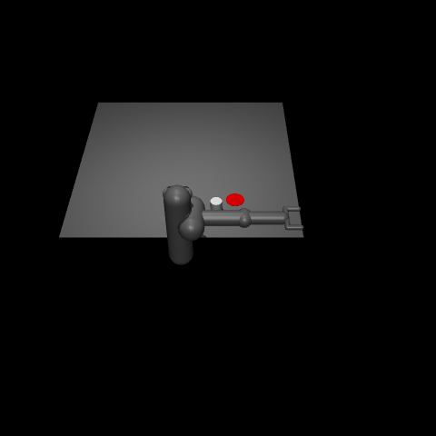

# SAFARI
Naive Re-implementation of Safe and Active Robot Imitation Learning with Imagination for RL agents. Just for fun

## Project Structure so far

- `src/`
  - `ActiveLearning.py`: Main training and active learning loop.
  - `dynamicsNetwork.py`: Dynamics model definition and training.
  - `policyNetwork.py`: Policy network definition and action selection.
  - `uncertaintyNetwork.py`: Uncertainty estimation network.

> **Note:** The core architecture and training pipeline are implemented, but the project is still incomplete.

> **Note:** Currently the architecture is set to run on the env `Pusher-v5` 
 
|  | 

## TODO

- [ ] Implement `expert_action` function (currently returns a random action). Tailor this method to your target control system (in `ActiveLearning` class).
- [ ] Add inference logic to perform policy rollout and evaluation.


## Requirements

- Python >=3.10
- PyTorch
- Gymnasium with MuJoCo support
- `tqdm`, `numpy`, `gymnasium`, etc.

### Install dependencies:

I suggest using a virtual env, but it's up to you. 

#### Virtual Env: 
In case (for Linux): 

```bash
sudo apt update
sudo apt install -y \
  make build-essential libssl-dev zlib1g-dev \
  libbz2-dev libreadline-dev libsqlite3-dev curl \
  libncursesw5-dev xz-utils tk-dev libxml2-dev \
  libxmlsec1-dev libffi-dev liblzma-dev git
```

```bash
git clone https://github.com/pyenv/pyenv.git ~/.pyenv

```

If you use bash else change /.bashrc with /.zshrc

```bash
echo 'export PYENV_ROOT="$HOME/.pyenv"' >> ~/.bashrc
echo 'export PATH="$PYENV_ROOT/bin:$PATH"' >> ~/.bashrc
echo 'eval "$(pyenv init --path)"' >> ~/.bashrc
echo 'eval "$(pyenv init -)"' >> ~/.bashrc

```

```bash
exec "$SHELL"
```

```bash
pyenv virtualenv <env-name> 
```

#### Requirements

```bash
pip install -r requirements.txt
```

## Usage

Run the active learning script:

```bash
python src/ActiveLearning.py
```

Ensure MuJoCo is properly installed and `MUJOCO_PY_MUJOCO_PATH` is set.


## Contributing

Feel free to open issues or pull requests for enhancements or bug fixes.

@article{dipalo2020safari,
  title   = {SAFARI: Safe and Active Robot Imitation Learning with Imagination},
  author  = {Di Palo, Norman and Johns, Edward},
  journal = {arXiv preprint arXiv:2011.09586},
  year    = {2020},
  doi     = {10.48550/arXiv.2011.09586},
  url     = {[https://arxiv.org/abs/2011.09586](https://arxiv.org/pdf/2011.09586)}
}

---

